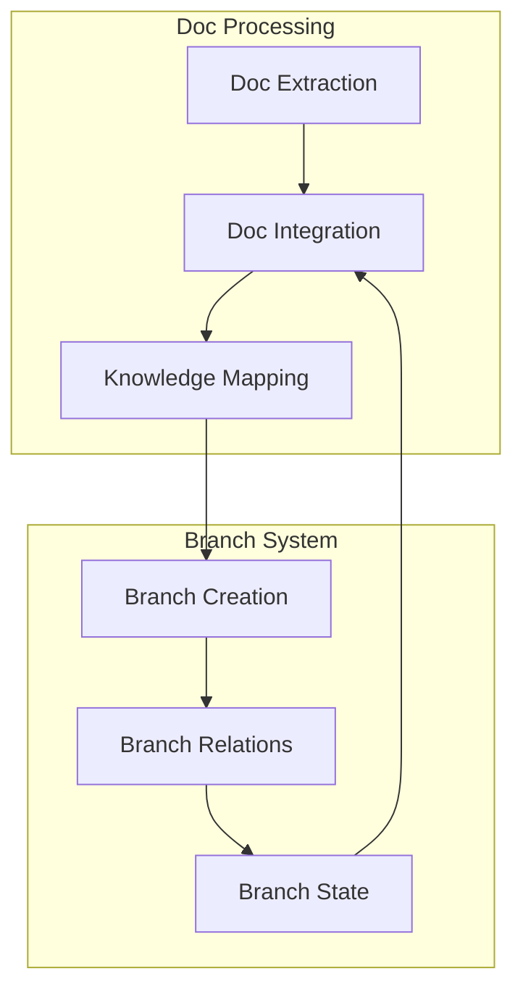
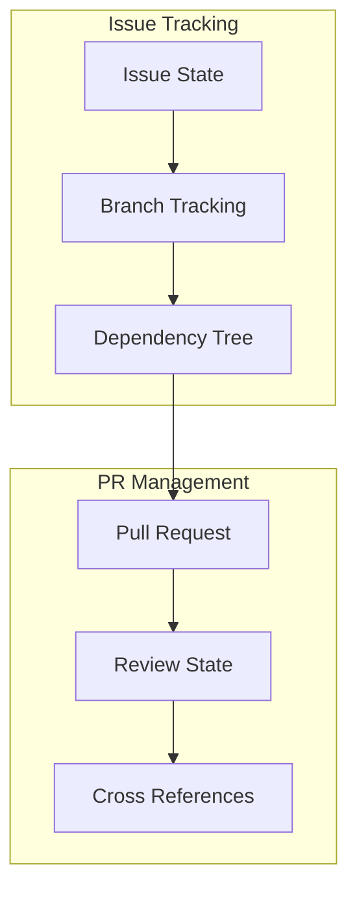

# DevDocs MCP Implementation Continuation

## Current State

We've completed the initial implementation phase of the DevDocs MCP system, including:

1. Core Resource Template System
   - URI-based template handling
   - Parameter extraction and validation
   - Type-safe implementation with Pydantic V2
   - Comprehensive error handling

2. Testing Infrastructure
   - Property-based tests with Hypothesis
   - Edge case validation
   - Error scenario coverage
   - Type safety verification

3. Project Structure
   - Modular package organization
   - Dependency management with UV
   - Version control setup
   - Documentation framework

## New Insights

Two powerful capabilities have emerged:

1. Documentation Integration Flow:


2. Task Management System:


## Implementation Focus Areas

1. Core Resource System:
- URI template implementation
- Resource generation
- Cache management
- Error handling

2. Documentation Integration:
- Documentation scraping
- Content distillation
- Branch mapping
- Dynamic updates

3. Task Management:
- Issue/PR representation
- State management
- Dependency tracking
- Cross-referencing

## Testing Requirements

1. Property-Based Tests:
```python
@given(st.text(min_size=1).map(lambda s: f'docs://{s}'))
def test_doc_integration(uri):
    # Test documentation integration flow
    
@given(st.dictionaries(st.text(), st.text()))
def test_task_management(task_data):
    # Test task management system
```

2. Async Testing:
```python
async def test_concurrent_doc_processing():
    async with trio.open_nursery() as nursery:
        # Test concurrent documentation processing
        
async def test_task_state_transitions():
    # Test task state management
```

## Implementation Guidelines

1. Follow TDD approach:
- Write property-based tests first
- Implement minimal passing code
- Refactor for clarity and efficiency

2. Use Trio for async operations:
- Leverage nurseries for concurrent operations
- Implement proper cancellation
- Handle timeouts appropriately

3. Implement error handling:
- Use structured error types
- Implement recovery strategies
- Maintain system stability

4. Focus on integration:
- Documentation processing pipeline
- Task management system
- Branch state management

## Next Steps

1. Documentation Processing Pipeline
   - Implement filter stack system
   - Create content processors
   - Add transformation pipeline
   - Build entry indexing

2. Version Management
   - Add version support to ResourceTemplate
   - Implement version normalization
   - Create version-aware paths
   - Support multiple versioning schemes

3. Storage Layer
   - Implement metadata storage
   - Add entry indexing system
   - Create efficient lookup
   - Support versioned content

4. Integration Layer
   - Add documentation source handlers
   - Implement content extractors
   - Create transformation filters
   - Build monitoring system

## Implementation Strategy

```mermaid
flowchart TD
    subgraph "Phase 1: Processing"
        FS[Filter Stack] --> CP[Content Processing]
        CP --> TP[Transform Pipeline]
    end
    
    subgraph "Phase 2: Versioning"
        VM[Version Management] --> VP[Version Paths]
        VP --> VS[Version Storage]
    end
    
    subgraph "Phase 3: Storage"
        MS[Metadata Storage] --> EI[Entry Index]
        EI --> LS[Lookup System]
    end
    
    Phase 1 --> Phase 2
    Phase 2 --> Phase 3
```

## Success Metrics

1. Processing Pipeline
   - Filter stack performance
   - Content transformation accuracy
   - Pipeline extensibility
   - Error handling coverage

2. Version Management
   - Version detection accuracy
   - Path generation correctness
   - Inheritance handling
   - Update management

3. Storage System
   - Lookup performance
   - Storage efficiency
   - Index accuracy
   - Version isolation

4. Integration Points
   - Source handler coverage
   - Transformation reliability
   - System monitoring
   - Resource optimization

## Branch Structure

Continue using the branch-thinking tool for:
- Implementation tracking
- Task management
- Documentation integration
- Progress monitoring

## Questions to Consider

1. How should documentation updates trigger branch updates?
2. What is the optimal task state representation in branches?
3. How can we maintain performance with increased integration?
4. What monitoring metrics are most important?

## Success Criteria

1. Documentation Integration:
- Successful processing of documentation
- Accurate branch mapping
- Efficient updates

2. Task Management:
- Clear state representation
- Accurate dependency tracking
- Efficient cross-referencing

3. System Performance:
- Response time within bounds
- Resource usage within limits
- Proper error handling

Continue with the implementation phase, maintaining the same attention to detail and systematic approach demonstrated in the analysis phase.