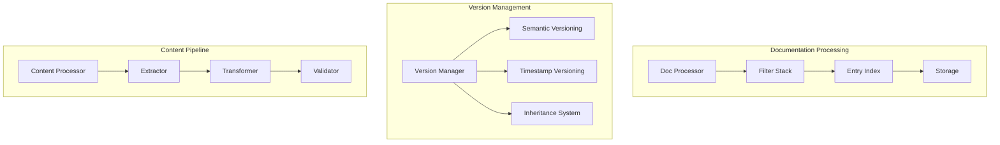

# DevDocs Implementation Insights

## Core Architecture Patterns



## Applicable Patterns for Our Implementation

1. **Resource Template Enhancement**
   ```python
   class DocumentationResource(ResourceTemplate):
       """Enhanced resource template with versioning support."""
       model_config = ConfigDict(arbitrary_types_allowed=True)
       
       version: Optional[str] = Field(None, description="Resource version")
       release: Optional[str] = Field(None, description="Release identifier")
       metadata: Dict[str, Any] = Field(default_factory=dict)
       
       def get_version_slug(self) -> str:
           """Generate version-specific slug."""
           if not self.version:
               return self.uri_template
           return f"{self.uri_template}~{self._normalize_version(self.version)}"
   ```

2. **Filter Stack Implementation**
   ```python
   class FilterStack:
       """Process documentation through multiple filters."""
       def __init__(self):
           self.filters: List[Filter] = []
           
       def add(self, filter_: Filter) -> None:
           self.filters.append(filter_)
           
       async def process(self, content: str) -> str:
           """Process content through filter stack."""
           for filter_ in self.filters:
               content = await filter_.apply(content)
           return content
   ```

3. **Entry Indexing System**
   ```python
   class EntryIndex:
       """Index documentation entries for quick lookup."""
       def __init__(self):
           self.entries: Dict[str, Entry] = {}
           self.path_index: Dict[str, str] = {}
           
       def add(self, entry: Entry) -> None:
           """Add entry to index with path mapping."""
           self.entries[entry.id] = entry
           self.path_index[entry.path] = entry.id
           
       def find_by_path(self, path: str) -> Optional[Entry]:
           """Lookup entry by path."""
           entry_id = self.path_index.get(path)
           return self.entries.get(entry_id)
   ```

## Integration Strategy

1. **Documentation Processing Pipeline**
   ```mermaid
   flowchart LR
       Input[Doc Source] --> Extract[Content Extraction]
       Extract --> Transform[Content Transform]
       Transform --> Index[Entry Indexing]
       Index --> Store[Storage Layer]
   ```

2. **Version Management**
   ```mermaid
   flowchart TD
       Version[Version Check] --> Semantic[Semantic Version]
       Version --> Timestamp[Timestamp Version]
       Semantic --> Normalize[Normalize Version]
       Timestamp --> Normalize
       Normalize --> Store[Store Version]
   ```

3. **Storage Strategy**
   ```mermaid
   flowchart LR
       Content[Content] --> Meta[meta.json]
       Content --> Index[index.json]
       Content --> DB[db.json]
       
       subgraph "Storage Layer"
           Meta
           Index
           DB
       end
   ```

## Implementation Benefits

1. **Improved Version Handling**
   - Support for multiple versioning schemes
   - Version-specific resource paths
   - Inheritance-based version management

2. **Enhanced Processing**
   - Modular filter system
   - Extensible transformation pipeline
   - Clear separation of concerns

3. **Better Resource Management**
   - Structured metadata storage
   - Efficient entry indexing
   - Flexible content organization

## Next Steps for Our Implementation

1. **Version Enhancement**
   - Add version support to ResourceTemplate
   - Implement version normalization
   - Create version-aware paths

2. **Processing Pipeline**
   - Implement filter stack system
   - Create basic content processors
   - Add transformation pipeline

3. **Storage Layer**
   - Add metadata storage
   - Implement entry indexing
   - Create efficient lookup system

4. **Integration Points**
   - Add documentation source handlers
   - Implement content extractors
   - Create transformation filters

This analysis provides a roadmap for enhancing our current implementation with proven patterns from the DevDocs system while maintaining our MCP-specific requirements and architecture.